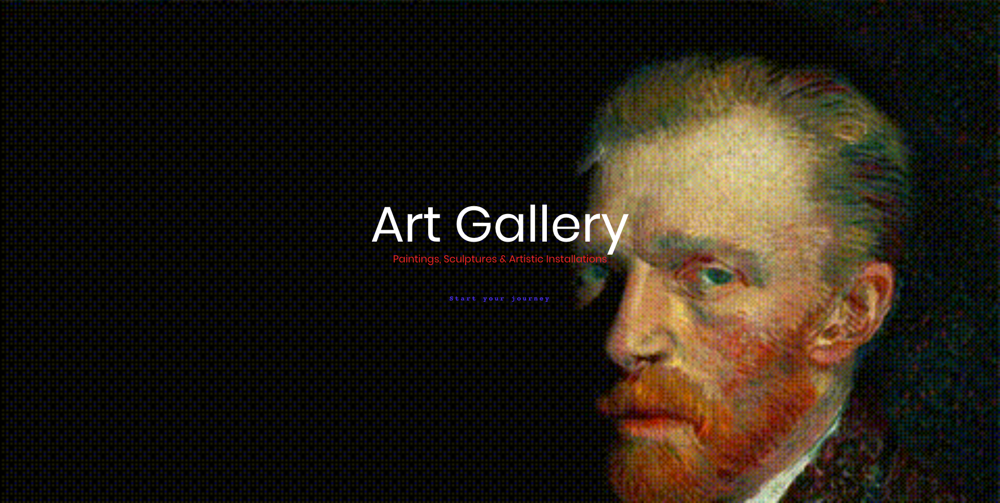
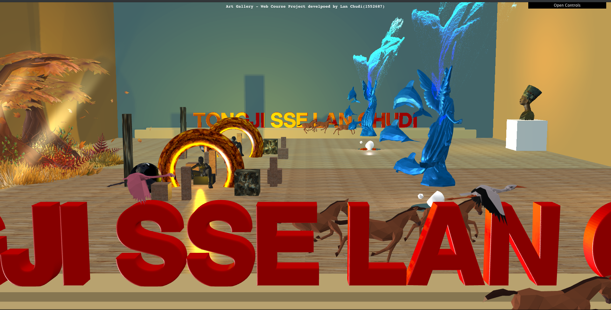
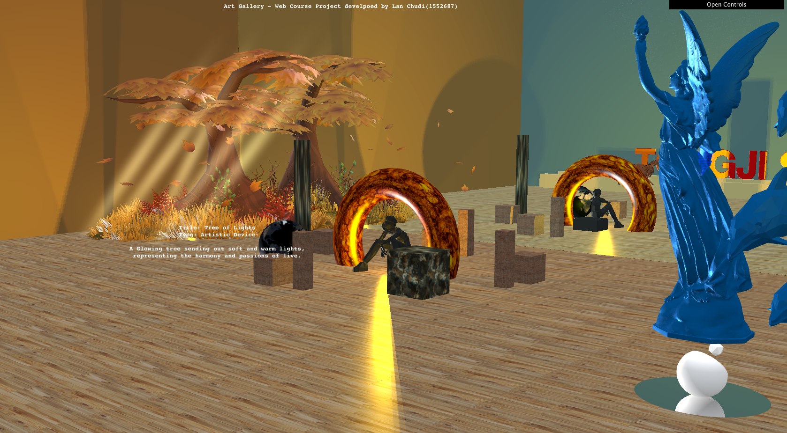
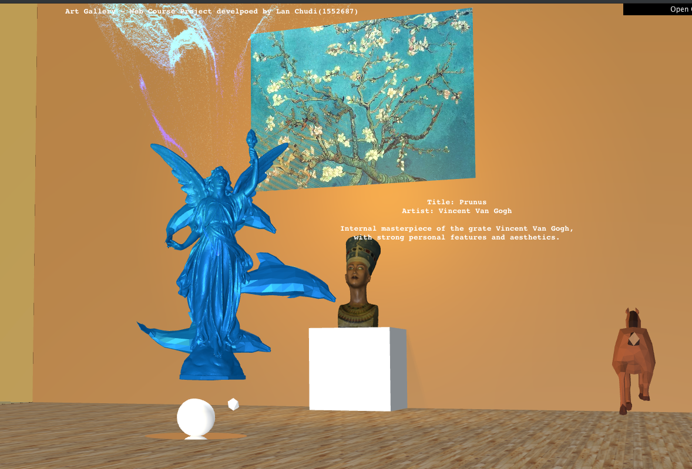
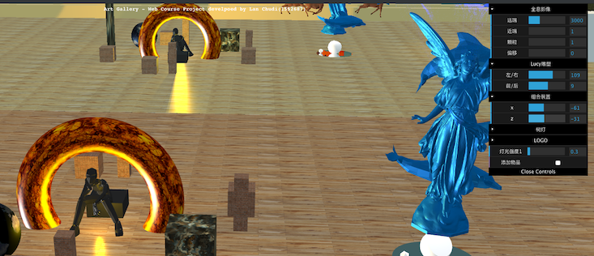
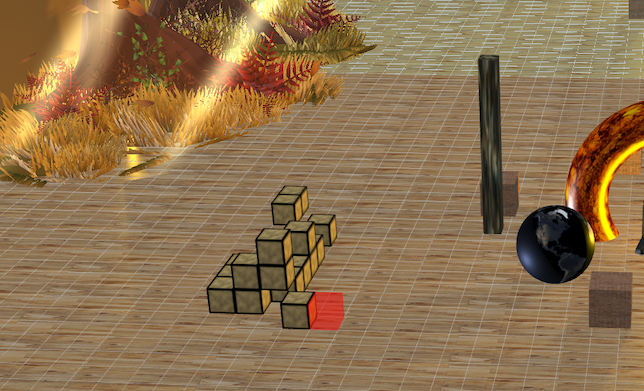
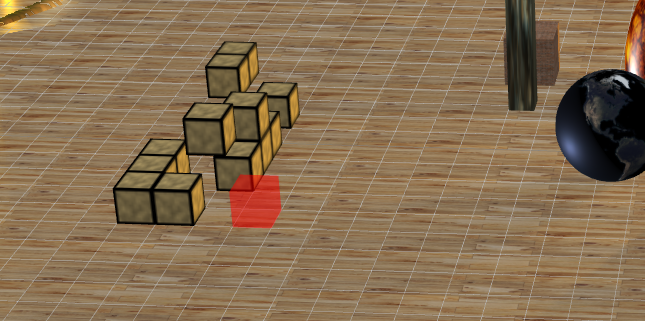
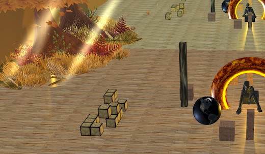

# ArtGallery

> Web系统2019春季学期课程大作业

1552687 蓝楚迪

### 项目简介

使用THREE.js实现简单的展览馆布局与简单的交互。

### 运行方式

- 将文件夹拷贝到nginx等引擎的主目录下，在浏览器访问http://localhost/1552687-art-gallery/index.html
- 或访问已部署到服务器的地址 http://nskins.site/web-course-project.html

### 项目功能

##### 0. 欢迎页面

欢迎页是大佬的winks。

##### 1. 进入页面

展品大多数为加载的多种格式的3D模型，包含动画效果、全息影像效果、反射镜等。

##### 2. 查看展品详情

将鼠移动到展品上可以查看对应的说明信息。

##### 3. 视野控制

可通过鼠标左键来旋转画面、右键拖动平移、鼠标滚动缩放。

还可以通过键盘的上下左右键进行平移。

##### 4. 移动物品、调整光线、调整全息影像效果

点击页面右上角的Open Controls，在操作面板中滑动滚条来修改参数。

##### 5. 添加/移除物品

点击控制面板中的"添加物品"，可进入添加物品模式

鼠标单机对应网格，即可添加物品。

同时按住shift+鼠标单机，即可移除物品。

取消勾选后，完成添加物品。

### 使用技术

* HTML
* CSS
* JavaScript
* THREE.js

